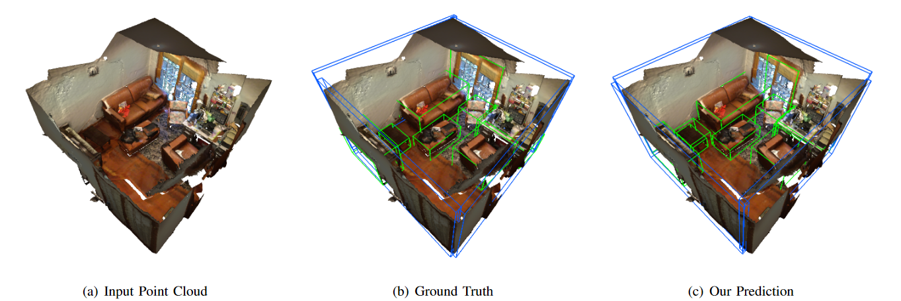
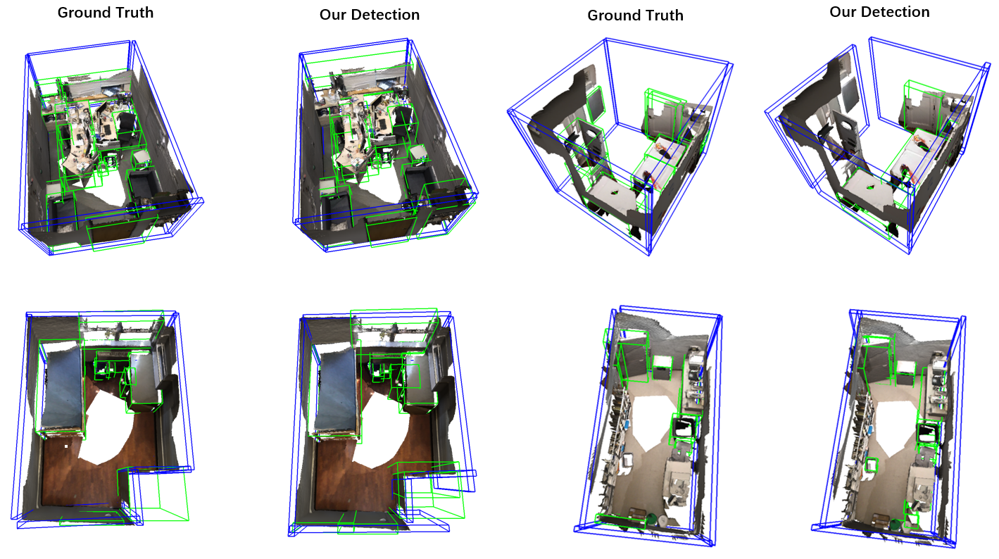
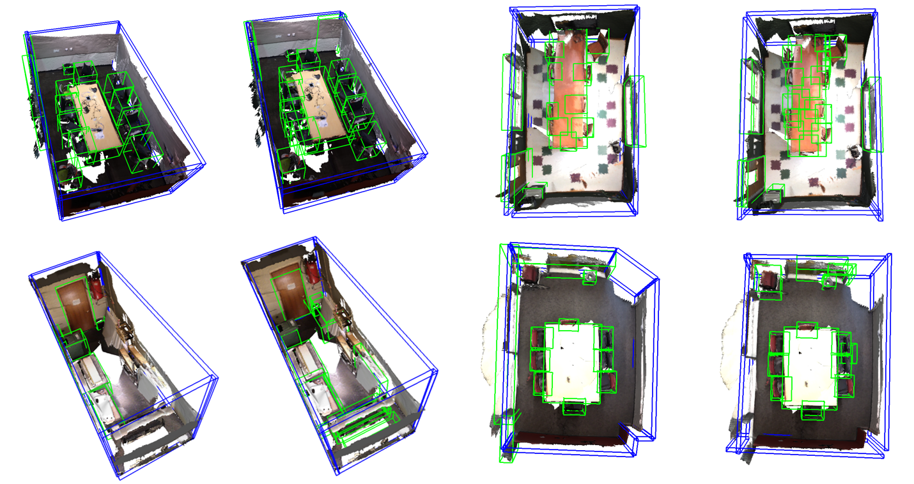
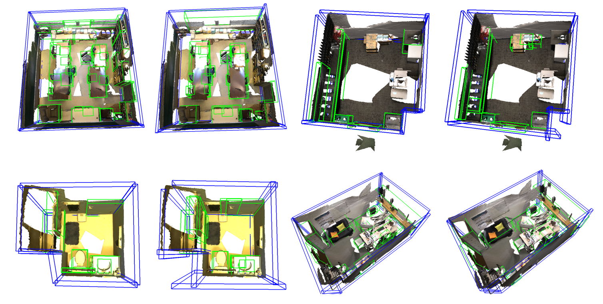
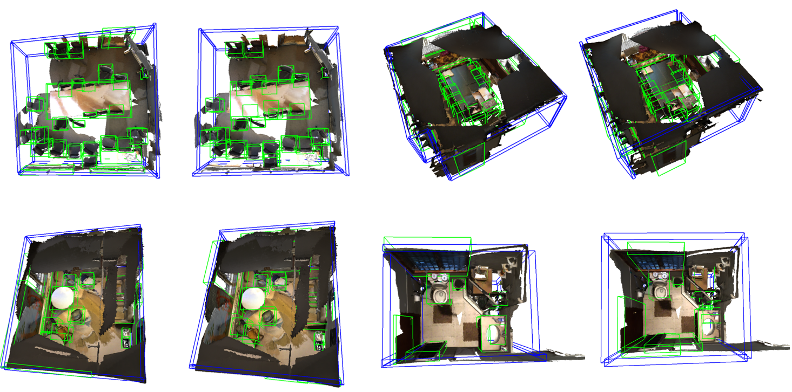
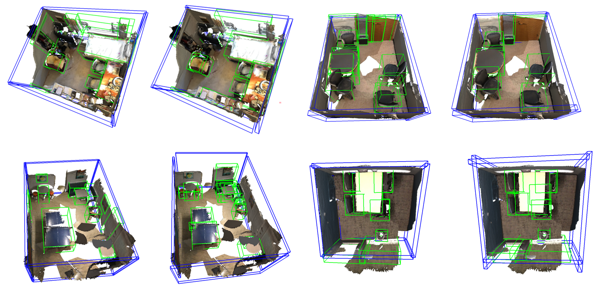
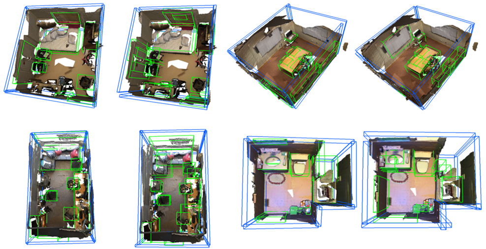

# PQ-Transformer: Jointly Parsing 3D Objects and Layouts from Point Clouds

[**Paper**](https://arxiv.org/abs/2109.05566) 

Accepted to RA-L & ICRA 2022.

Created by Xiaoxue Chen, Hao Zhao, Guyue Zhou and Ya-Qin Zhang from <a href="http://air.tsinghua.edu.cn/EN/" target="_blank">Institute for AI Industry Research(AIR), Tsinghua University</a>.

## Introduction

3D scene understanding from point clouds plays a vital role for various robotic applications. Unfortunately, current state-of-the-art methods use separate neural networks for different tasks like object detection or room layout estimation. Such a scheme has two limitations: (1) Storing and running several networks for different tasks are expensive for typical robotic platforms. (2) The intrinsic structure of separate outputs are ignored and potentially violated. 

In this repository, we propose the first transformer architecture that predicts 3D objects and layouts simultaneously, using point cloud inputs. Unlike existing methods that either estimate layout keypoints or edges, we directly parameterize room layout as a set of quads. As such, the proposed architecture is termed as P(oint)Q(uad)-Transformer. Along with the novel quad representation, we propose a tailored physical constraint loss function that discourages object-layout interference. The quantitative and qualitative evaluations on the public benchmark ScanNet show that the proposed PQ-Transformer succeeds to jointly parse 3D objects and layouts, running at a quasi-real-time (8.91 FPS) rate without efficiency-oriented optimization. Moreover, the new physical constraint loss can improve strong baselines, and the F1-score of the room layout is significantly promoted from 37.9\% to 57.9\%. Code and models will be made publicly available.

## Citation

If you find our work useful in your research, please consider citing:

    @article{chen2022pq,
      title={Pq-transformer: Jointly parsing 3d objects and layouts from point clouds},
      author={Chen, Xiaoxue and Zhao, Hao and Zhou, Guyue and Zhang, Ya-Qin},
      journal={IEEE Robotics and Automation Letters},
      year={2022},
      publisher={IEEE}
    }

## Installation

### Requirements
    
    python =3.6
    CUDA>=10.1
    Pytorch>=1.3
    matplotlib
    opencv-python
    tensorboard
    termcolor
    plyfile
    trimesh>=2.35.39
    networkx>=2.2
    scripy
    

Compile the CUDA layers for [PointNet++](http://arxiv.org/abs/1706.02413):

    cd pointnet2
    python setup.py install

### Data preparation

For 3D detection on ScanNet, follow the [README](https://github.com/facebookresearch/votenet/blob/master/scannet/README.md) under the `scannet` folder.

For layout estimation on ScanNet, download the sceneCAD layout dataset from 
[HERE](http://kaldir.vc.in.tum.de/scannet_planes).  Unzip it into `/path/to/project/scannet/`.

## Run Pre-trained Model

You can download pre-trained model [HERE](https://drive.google.com/file/d/1yawlsprl-bhRotpZS29inQo4f4ZSZSY-/view?usp=sharing).
Move the file to the project root path (`/path/to/project/pretrained_model`) and then run:

    CUDA_VISIBLE_DEVICES=0 python -m torch.distributed.launch --nproc_per_node 1 eval.py --checkpoint_path /path/to/project/pretrained_model/ckpt_epoch_last.pth

The demo uses the pre-trained model to jointly detect objects and layouts from point cloud of an indoor scene. You can get dump visualized results with:

    CUDA_VISIBLE_DEVICES=0 python -m torch.distributed.launch --nproc_per_node 1 eval.py --checkpoint_path /path/to/project/pretrained_model/ckpt_epoch_last.pth --dump

And then you can use 3D visualization software such as the [MeshLab](http://www.meshlab.net/) to open the `.ply` files under `/path/to/project/demo/` to see the 3D detection output.

## Training and evaluating

To train a PQ-Transformer model on Scannet with a single GPU:

    CUDA_VISIBLE_DEVICES=0 python -m torch.distributed.launch --nproc_per_node 1 train.py  --log_dir log/[log_dir] --pc_loss
    
You can change the learning rate, number of proposals or other parameters with arguments shown in `train.py`.

To test the trained model with its checkpoint:

    CUDA_VISIBLE_DEVICES=0 python -m torch.distributed.launch --nproc_per_node 1 eval.py  --log_dir [log_dir] --checkpoint_path [checkpoint_path]

## Acknowledgements
We want to thank codebase of [VoteNet](https://github.com/facebookresearch/votenet) and [Group-Free](https://github.com/zeliu98/Group-Free-3D). And also thanks to dataset [ScanNet](https://github.com/ScanNet/ScanNet) and layout annotation from [SceneCAD](https://github.com/skanti/SceneCAD).

